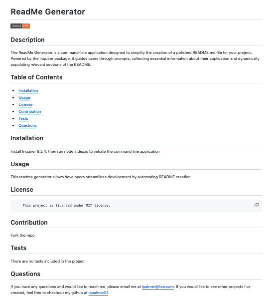

# ReadMe Generator

The ReadMe Generator is a command-line application designed to simplify the creation of a polished README.md file for your project. Powered by the Inquirer package, it guides users through prompts, collecting essential information about their application and dynamically populating relevant sections of the README.

## Table of Contents 

#### -  [Installation](#installation)
#### -  [Usage](#usage)
#### -  [Project Links](#projectlinks)
#### -  [Questions](#questions)
#### -  [Credits](#credits)

## Installation

- Install Inquirer 8.2.4
- Run 'node index.js' to initiate the command line application
- Once the user has answered the prompts, find the generated README.file in the ./output folder.

## Usage
This readme generator allows developers streamlines development by automating README creation.

## Project Links

[Click here](https://drive.google.com/file/d/1YMLljMP8Ne0P2cQNAqne1C4OFUiP30sj/view) to view the walkthrough video that demonstates the application's functionality.

The image below depicts a sample ReadME generated using the command line application. 

## Questions 
If you have any questions and would like to reach me, please email me at lpalmer@live.com.

If you would like to see other projects I've created, feel free to chechout my github at [lepalmer01](https://github.com/lepalmer01).

## Credits

Thank you for the tips and suggestions from Bootcamp instructors, learning assistants, classmates, and resources. Thank you to my tutor Sara for insights regarding my code. I have used http://www.stackoverflow.com, and https://chat.openai.com to research information. Lastly,thanks to OpenAI's Chatgpt-4 for assistance in creating this README.md template.